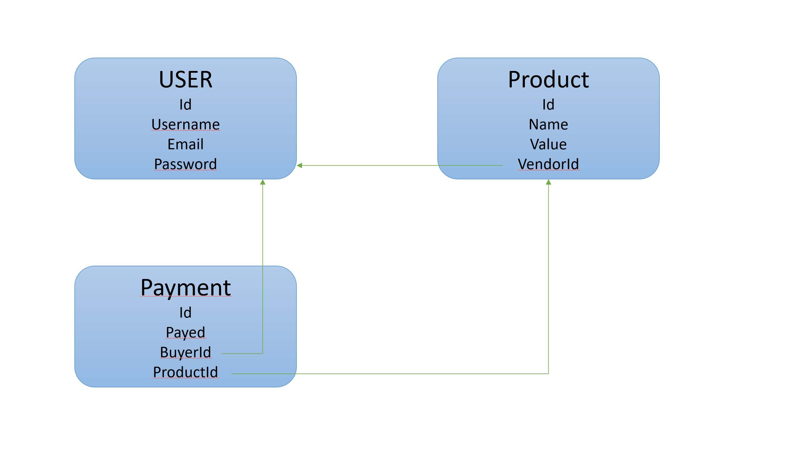

# 1 DB per service

## Global explanation

This is a business simplified online store app. You can signup, login and do CRUD operation on users. You can do CRUD operations on Product and Payments.

### Services

We have 3 services :
- User
- Product
- Payment

### Data model

The user has :
- username *(string)*
- email *(string)*
- password *(string, hashed)*
- id *(PK)*

The product has :
- name *(string)*
- value *(number)*
- vendorId *(string)*
- id *(PK)*
 
The Payment has :
- payed *(number)*
- buyerId *(string)*
- productId *(string)*
- id *(PK)*

### Flow

The user service is independant. It can do CRUD operations, and has a signin route to get a jwt.

The product service is also independant. CRUD operations with authorization verification (by jwt)

Finally, the Payment service is loosely coupled to the user and product by the data. It has a verification process on existence of the product you are trying to buy and the user who is buying.

### Technologies

We use nodejs for all the api developpment. The orchestrator is docker with docker-compose to instanciate all the api on the same network.

We use REST endpoints to interact.

All documentation can be found on swagger (http://API_ROUTE/api/v1/docs)

